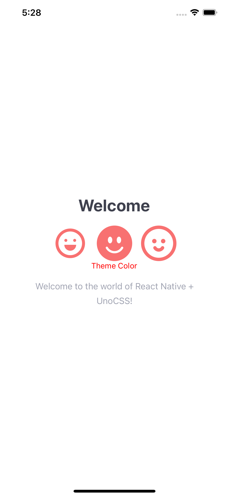

# Unonative Demo
This project serves as a scaffold and demonstrates the basic usage of unonative, as well as the combination of icon and typescript.


## screenshot


## Install
```bash
yarn install
```
## Start
```bash
yarn start
```
